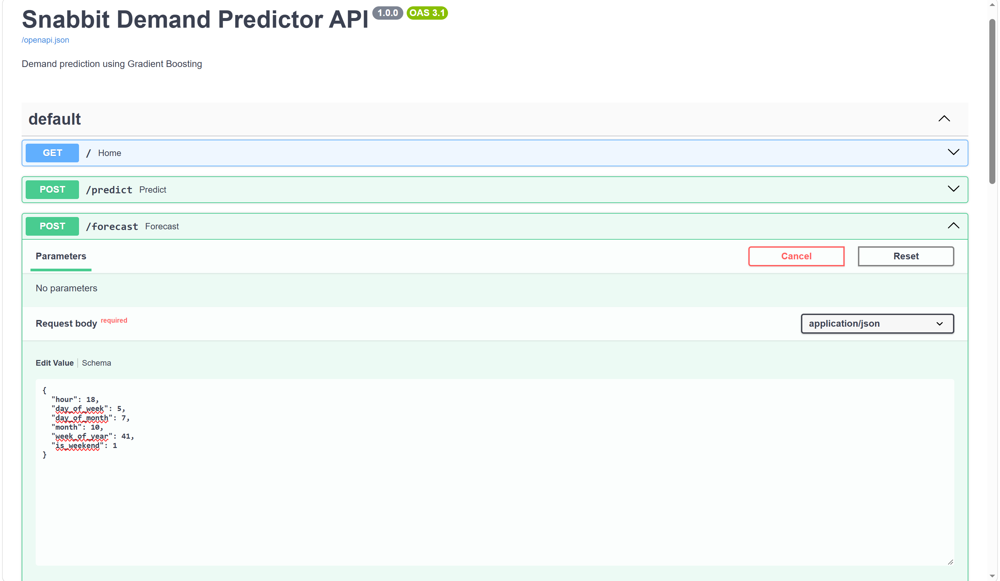

# 📊 Snabbit Demand Predictor

### Machine Learning-Powered Demand Forecasting Web Application

> A full-stack machine learning application that predicts demand using time-based features and a trained Gradient Boosting regression model. Built with Python, FastAPI, and a responsive web interface.

---

## 🚀 Overview

**Snabbit Demand Predictor** is a machine learning project designed to estimate demand based on temporal patterns such as hour, day of the week, month, and week of the year.

The application combines a trained machine learning model with a FastAPI backend and an interactive frontend, allowing users to enter time-related information and receive demand predictions in real time.

The project focuses on applying machine learning in a practical application with API integration, input validation, and an accessible user interface.

This project is developed as a proof-of-concept using synthetic but realistic demand data. It demonstrates how time-based demand predictions can support operational planning and decision-making.

### Project Objectives

- Build a machine learning model for demand prediction.
- Develop an API for serving machine learning predictions.
- Create a responsive dashboard for user interaction.
- Validate incoming prediction requests.
- Evaluate model performance using regression metrics.
- Demonstrate an end-to-end machine learning application.

---

## ✨ Features

- 📈 **Demand Prediction:** Estimate demand using a trained Gradient Boosting model.

- ⚡ **FastAPI Backend:** REST API for serving machine learning predictions.

- 🖥️ **Interactive Dashboard:** Clean and responsive frontend interface.

- 🔒 **Input Validation:** Validates request data through frontend and backend constraints.

- 🔄 **Real-Time API Communication:** Connects the frontend with the `/predict` endpoint.

- 📅 **Time-Based Features:** Uses hour, weekday, day, month, and week-of-year information.

- 🧪 **API Testing:** Supports endpoint verification through FastAPI Swagger UI.

- 🧩 **Modular Architecture:** Separates backend routes, model services, and frontend assets.

- 📊 **Model Evaluation:** Measures performance using MAE, RMSE, MAPE, and R² Score.

- 🖼️ **Dashboard Demonstration:** Includes a screenshot of the working prediction dashboard.

---

## 🛠️ Tech Stack

| Category | Technology |
|---|---|
| Programming Language | Python |
| Machine Learning | Scikit-learn |
| ML Algorithm | Gradient Boosting Regressor |
| Backend Framework | FastAPI |
| ASGI Server | Uvicorn |
| Frontend | HTML, CSS, JavaScript |
| API Format | REST / JSON |
| API Documentation | Swagger UI / OpenAPI |
| Data Processing | Pandas, NumPy |
| Development Environment | Python Virtual Environment |
| Version Control | Git / GitHub |

---

## 🧠 Machine Learning

### Model

The application uses a **Gradient Boosting Regression** machine learning model to estimate demand.

Gradient Boosting is an ensemble learning technique that builds a prediction model by combining multiple decision trees sequentially. Each new tree focuses on improving the errors made by the previous trees.

The trained model uses time-based features to learn demand patterns from the generated dataset.

### Models Evaluated

The following models were evaluated:

1. Average Bookings by Hour — baseline
2. Linear Regression
3. Random Forest Regressor
4. Gradient Boosting Regressor

The models were evaluated on a held-out test set using:

- MAE
- RMSE
- R²

### Input Features

The model receives the following time-based features:

| Feature | Description |
|---|---|
| `hour` | Hour of the day (0–23) |
| `day_of_week` | Day of the week (0–6) |
| `day_of_month` | Day of the month (1–31) |
| `month` | Month of the year (1–12) |
| `week_of_year` | Week of the year (1–53) |
| `is_weekend` | Whether the date falls on a weekend |

### Feature Purpose

The time-based features help the model learn recurring demand patterns.

- **Hour:** Captures variations in demand during different hours.
- **Day of Week:** Represents weekly demand patterns.
- **Day of Month:** Provides calendar-related information.
- **Month:** Represents monthly and seasonal patterns.
- **Week of Year:** Provides information about the position of a week in the year.
- **Is Weekend:** Distinguishes weekend and weekday demand patterns.

### Prediction Output

The model returns an estimated demand value in units.

> Note: The displayed prediction is a model estimate and should not be treated as guaranteed real-world demand.

---

## 🏗️ Project Architecture

```text
snabbit_demand_predictor/

│
├── assets/
│   └── dashboard_top.png
    └── dashboard_bottom.png
    └── api_forecast.png

│
├── backend/
│   ├── app.py
│   ├── routes.py
│   └── model_service.py
│
├── data/
│
├── frontend/
│   ├── static/
│   │   ├── dashboard.js
│   │   └── style.css
│   │
│   └── templates/
│       └── dashboard.html
│
├── model/
│
├── notebooks/
│   └── eda_and_modeling.ipynb
│
├── outreach/
│
├── .gitignore
├── requirements.txt
└── README.md
```

### Architecture Flow

```text
User Input
    │
    ▼
Frontend Dashboard
    │
    ▼
JavaScript Fetch API
    │
    ▼
FastAPI Backend
    │
    ▼
Input Validation
    │
    ▼
Gradient Boosting Model
    │
    ▼
Demand Prediction
    │
    ▼
JSON Response
    │
    ▼
Frontend Result Display
```

### Component Responsibilities

| Component | Responsibility |
|---|---|
| Frontend Dashboard | Collects user inputs |
| JavaScript | Sends API requests and displays results |
| FastAPI Backend | Handles API requests |
| Request Validation | Checks incoming feature values |
| Model Service | Loads the trained model |
| Gradient Boosting Model | Generates demand predictions |
| JSON Response | Returns the prediction to the frontend |

---

## ⚙️ Installation & Setup

### 1. Clone the Repository

```bash
git clone YOUR_GITHUB_REPOSITORY_URL
```

Navigate into the project directory:

```bash
cd snabbit_demand_predictor
```

### 2. Create a Virtual Environment

Windows:

```bash
python -m venv venv
```

Activate the virtual environment:

```bash
venv\Scripts\activate
```

### 3. Install Dependencies

```bash
pip install -r requirements.txt
```

### 4. Run the Application

Start the FastAPI development server:

```bash
uvicorn backend.app:app --reload
```

The exact startup command should match your local project configuration.

### 5. Open the Application

Dashboard:

```text
http://127.0.0.1:8000/
```

API Documentation:

```text
http://127.0.0.1:8000/docs
```

The Swagger UI interface can be used to inspect and test the available API endpoints.

---

## 🔌 API Documentation

### POST `/predict`

Generates a demand prediction using the supplied input features.

### Request Body

```json
{
  "hour": 17,
  "day_of_week": 2,
  "day_of_month": 20,
  "month": 9,
  "week_of_year": 38,
  "is_weekend": false
}
```

### Example Response

```json
{
  "prediction": 74
}
```

> The response structure above is illustrative. Confirm the exact response fields in your implementation before publishing this example.

### HTTP Status Codes

| Status Code | Meaning |
|---|---|
| `200` | Successful prediction |
| `422` | Invalid request data |
| `500` | Internal server error |

### API Workflow

1. The user enters time-based feature values.
2. The frontend sends the data to the `/predict` endpoint.
3. FastAPI validates the incoming request.
4. The trained model generates a demand prediction.
5. The backend returns the prediction as a JSON response.
6. The frontend displays the estimated demand.

---

## 🧪 Testing & Validation

The application has been tested through the frontend and FastAPI Swagger interface.

### Completed Verification

- [x] Frontend prediction with valid inputs
- [x] Frontend input constraints
- [x] Backend valid request testing
- [x] Backend invalid request testing
- [x] Swagger UI API testing
- [x] Boundary-value prediction testing
- [x] Final prediction testing
- [x] Dashboard prediction flow verification

### Validation Example

Invalid input:

```json
{
  "hour": 47,
  "day_of_week": 2,
  "day_of_month": 20,
  "month": 9,
  "week_of_year": 38,
  "is_weekend": false
}
```

Expected behavior:

```text
422 Unprocessable Entity
```

The backend should independently validate incoming requests, even when the frontend already restricts input values.

### Validation Purpose

Input validation helps prevent invalid feature values from being passed to the trained model.

The validation rules ensure that time-based inputs remain within their expected ranges.

---

### 📊 Final Model Evaluation

The Gradient Boosting model was evaluated using actual predictions and corresponding test data in the model evaluation notebook.

The evaluation metrics measure the difference between actual demand and predicted demand.


| Model | MAE | RMSE | R² |
|---|---:|---:|---:|
| Average Bookings by Hour | 8.86 | 11.48 | — |
| Linear Regression | 9.87 | 12.74 | — |
| Random Forest | 7.11 | 9.08 | 0.7069 |
| Gradient Boosting | 6.99 | 8.91 | 0.7174 |

The final Gradient Boosting model is saved as:

`model/gradient_boosting_model.pkl`


### Evaluation Metrics

| Metric | Value |
|---|---|
| Algorithm | Gradient Boosting |
| Evaluation Dataset | Held-out evaluation data |
| MAE | 7.69 |
| RMSE | 10.09 |
| MAPE | 13.62% |
| R² Score | 0.6375 |

### Evaluation Results

```text
Prophet Model Evaluation
------------------------------
MAE: 7.69
RMSE: 10.09
MAPE: 13.62%
R² Score: 0.6375
```

> The evaluation output above records the measured values from the completed evaluation cell. The displayed evaluation heading in the notebook should be updated to reflect the actual model being evaluated if it still says "Prophet."

### Metric Explanation

#### Mean Absolute Error (MAE)

MAE represents the average absolute difference between actual and predicted demand.

The measured MAE of **7.69** indicates that the average absolute prediction error in the evaluated dataset was 7.69 demand units.

#### Root Mean Squared Error (RMSE)

RMSE measures prediction error while giving greater weight to larger errors.

The measured RMSE was **10.09**.

#### Mean Absolute Percentage Error (MAPE)

MAPE expresses prediction error as a percentage of actual demand, using the non-zero actual values in the evaluation calculation.

The measured MAPE was **13.62%**.

#### R² Score

R² Score measures how much of the variation in the target values is explained by the model relative to a baseline that predicts the mean target.

The measured R² Score was **0.6375**.

> Evaluation metrics are dependent on the dataset, feature engineering, and evaluation methodology. These results should not be interpreted as guaranteed performance on real-world Snabbit demand data.

### Model Evaluation Interpretation

The evaluation results provide a quantitative view of the model's performance on the available evaluation data.

- MAE provides the average absolute error in demand units.
- RMSE highlights the impact of larger prediction errors.
- MAPE expresses relative error as a percentage.
- R² Score provides a measure of explained variation.

These metrics should be considered together when assessing the model.

### Evaluation Limitations

- The model is evaluated using the available project dataset.
- Synthetic data may not represent real-world booking patterns.
- Performance may change when trained on actual operational data.
- The evaluation results do not guarantee production-level forecasting accuracy.

---

## 🖥️ Dashboard

The project includes a browser-based dashboard that allows users to enter time-based information and receive demand predictions.

### Dashboard Features

- Input form for temporal features.
- Weekend selection.
- Demand prediction button.
- Predicted demand display.
- Model status indicator.
- Responsive dashboard layout.

### Dashboard Screenshot

The following screenshot demonstrates the working dashboard interface.


**Dashboard Preview:**

The dashboard provides an interface for entering the hour, day of the week, day of the month, month, week of the year, and weekend status.

The prediction result is displayed after submitting the input values.


### API Forecast



### Dashboard Workflow

```text
Enter Time-Based Features
          │
          ▼
Click Predict Demand
          │
          ▼
Send Request to FastAPI
          │
          ▼
Model Generates Prediction
          │
          ▼
Display Estimated Demand
```

> The dashboard is intended as a demonstration interface for the trained machine learning model.

---

## 📁 Main Components

### Backend

**`backend/app.py`**

Application entry point and FastAPI configuration.

**`backend/routes.py`**

Defines API routes and request handling.

**`backend/model_service.py`**

Handles model loading and prediction logic.

### Frontend

**`frontend/templates/dashboard.html`**

Provides the dashboard structure and input form.

**`frontend/static/dashboard.js`**

Collects user inputs, sends requests to the backend, and displays prediction results.

**`frontend/static/style.css`**

Provides dashboard styling and layout.

### Machine Learning

**`notebooks/eda_and_modeling.ipynb`**

Used for exploratory data analysis, model development, and evaluation.

### Assets

**`assets/Dashboardtop.png`**

Screenshot of the working demand prediction dashboard.

---

## 🔄 End-to-End Application Workflow

### Step 1: User Input

The user enters the required time-based features through the dashboard.

### Step 2: Request Validation

The frontend and backend apply input constraints to ensure the feature values are valid.

### Step 3: API Request

The frontend sends the validated input values to the FastAPI `/predict` endpoint.

### Step 4: Model Prediction

The backend passes the feature values to the trained Gradient Boosting model.

### Step 5: Response

The backend returns the model's prediction as a JSON response.

### Step 6: Result Display

The dashboard displays the estimated demand to the user.

---

## 📈 Machine Learning Workflow

The project follows a standard machine learning workflow.

### 1. Data Preparation

The dataset is prepared for model development using time-based features.

### 2. Exploratory Data Analysis

The notebook is used to inspect the data and explore demand patterns.

### 3. Feature Preparation

The required temporal features are prepared for training and prediction.

### 4. Model Training

A Gradient Boosting regression model is trained using the prepared dataset.

### 5. Model Evaluation

The model is evaluated using MAE, RMSE, MAPE, and R² Score.

### 6. Backend Integration

The trained model is integrated into the FastAPI backend.

### 7. Frontend Integration

The dashboard communicates with the API and displays the prediction results.

---

## 📊 Model Performance Metrics Summary

| Metric | Measured Result |
|---|---|
| MAE | 7.69 |
| RMSE | 10.09 |
| MAPE | 13.62% |
| R² Score | 0.6375 |

These results are based on the completed evaluation output recorded in the notebook.

---

## 🔮 Future Improvements

Potential improvements for future versions include:

- [ ] Add historical demand visualization.
- [ ] Compare multiple regression models.
- [ ] Display prediction confidence or uncertainty estimates where appropriate.
- [ ] Add model performance charts.
- [ ] Improve feature engineering for temporal patterns.
- [ ] Add automated tests for API validation.
- [ ] Deploy the application to a cloud platform.
- [ ] Add monitoring for model performance and input drift.

---

## ⚠️ Limitations

- Predictions depend on the quality and representativeness of the training data.
- Time-based features alone may not capture all factors affecting demand.
- Model performance should be assessed using a suitable held-out evaluation dataset.
- The current application is intended as a machine learning project and demonstration.
- The synthetic dataset does not represent Snabbit's private operational data.
- The measured evaluation metrics do not guarantee real-world demand prediction performance.
- Production deployment would require further validation using relevant operational data.

---

## 🎯 Learning Outcomes

Through this project, I practiced:

- Machine learning regression workflows.
- Gradient Boosting model implementation.
- Feature preparation for time-based prediction.
- Exploratory data analysis.
- Model evaluation using regression metrics.
- FastAPI backend development.
- REST API integration with JavaScript.
- Input validation and API testing.
- Connecting a trained model to a web application.
- Organizing a machine learning project for practical use.
- Documenting a machine learning application.

---

## 👨‍💻 Author

**Krish**

B.Tech CSE | Artificial Intelligence & Machine Learning

Interested in Machine Learning, AI Engineering, and building practical data-driven applications.

---

## 📄 License

This project is intended for educational and portfolio purposes.

Add an appropriate license when publishing the repository.